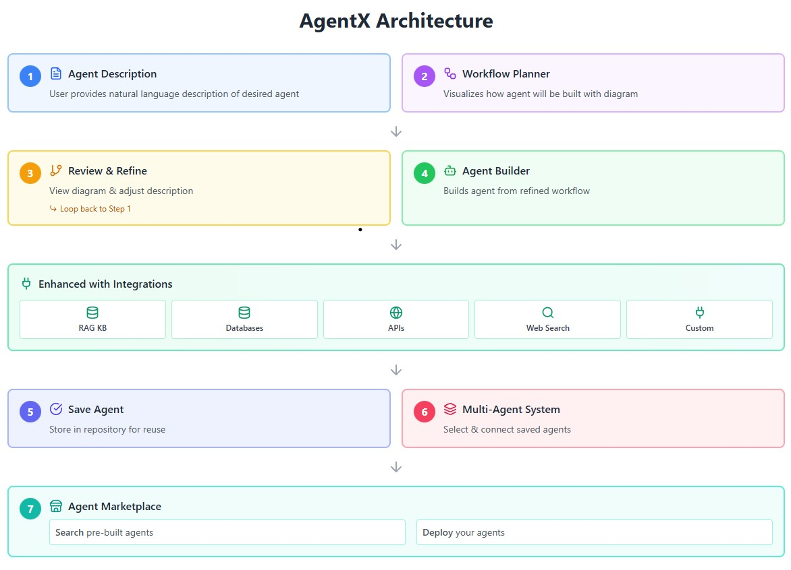

# AgentX: Automating AI Agent Creation through Knowledge-Driven Context Management

[](https://www.python.org/downloads/)

> Democratizing AI agent development through natural language prompts and visual workflow planning

## 🌟 Overview

**AgentX** is a revolutionary no-code platform that empowers non-technical users to create sophisticated AI agents without writing a single line of code. Through natural language descriptions and intuitive visual workflows, anyone can build, deploy, and orchestrate AI agents tailored to their specific needs.

### Why AgentX?

- 🚀 **No Coding Required** - Create complex AI agents using natural language prompts
- 📊 **Visual Workflow Planning** - See and refine how your agent will work before deployment
- 🔌 **Seamless Integrations** - Connect to databases, APIs, knowledge bases, and more
- 🤖 **Multi-Agent Systems** - Compose multiple agents to work together on complex tasks
- 🌐 **Community Marketplace** - Share and discover pre-built agents across domains
- 🎯 **Domain Agnostic** - Applicable across healthcare, agriculture, education, environmental monitoring, and more

## 🏗️ Architecture



AgentX follows a modular, layered architecture:

1. **User Interface Layer** - Agent description input, workflow visualization, marketplace
2. **Core Processing Engine** - Agent builder, workflow generator, orchestration layer
3. **Integration Layer** - RAG system, custom connectors (databases, APIs, web search)
4. **Storage & Deployment** - Agent repository, workflow templates, marketplace storage

## ✨ Key Features

### 1. Prompt-Driven Agent Creation
```
User Input: "Create an agent that monitors crop health, 
checks weather conditions, and recommends irrigation schedules"

AgentX Output: Fully functional agent with decision logic and workflows
```

### 2. Visual Workflow Planner
- Real-time visualization of agent decision flows
- Interactive diagram showing steps, conditions, and data flows
- Iterative refinement based on visual feedback

### 3. RAG Integration
Connect external knowledge bases to enhance agent contextual awareness:
- Document repositories
- Company wikis and knowledge bases
- Domain-specific guidelines

### 4. Custom Connectors
Connect agents to live data sources:
- **Databases**: PostgreSQL, MongoDB, MySQL, Redis
- **APIs**: REST, GraphQL, SOAP
- **Web Search**: Google, Bing, specialized search engines
- **File Systems**: Local and cloud storage

### 5. Multi-Agent Orchestration
Create complex systems by connecting multiple agents:
- Sequential workflows
- Parallel processing
- Hierarchical delegation
- Collaborative problem-solving

### 6. Agent Marketplace
- Discover pre-built agents across domains
- Deploy community agents with one click
- Share your agents with the community
- Version control and updates

---

*Empowering everyone to build AI agents, regardless of technical background*
